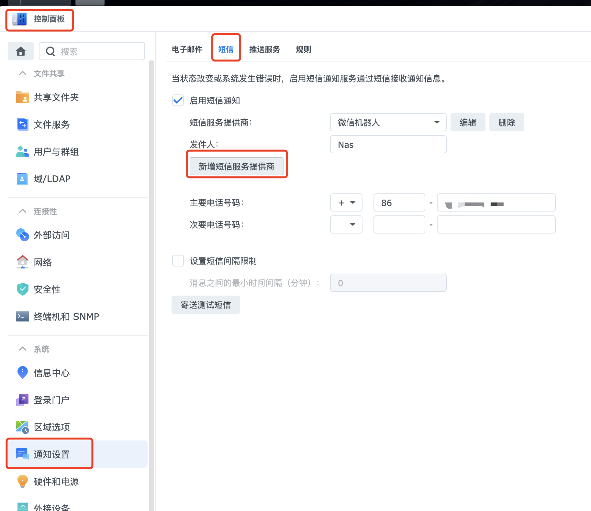
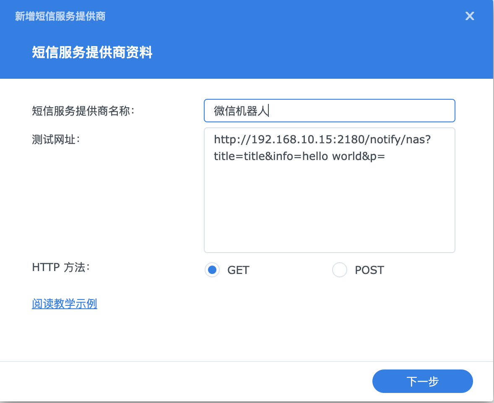

## 🚀 企业微信应用通知推送转发 - NAS消息代理服务

[](https://github.com/kerwin162/WeChatNotify/actions/workflows/docker-image.yml)
[](https://hub.docker.com/r/blackheads/wechat_notify)
[](https://github.com/xaoyaoo/PyWxDump/releases)

> 📢 专为群晖NAS设计的轻量级企业微信消息代理服务 | [English Document](#) (待补充英文版时添加)

## 一、🌟 项目背景

本人长期在使用群晖nas，但是群晖的通知推送只能推送到邮箱或者短信。看到网上前辈们将企业微信应用当做虚拟短信通知服务使用时茅塞顿开，于是就有了这个项目。

本项目通过对接**企业微信应用API**,实现：
✅ NAS告警实时推送到手机端  
✅ 零成本搭建私有化通知服务  
✅ Docker容器化一键部署  


## 二、🛠️ 快速开始

### I. Docker部署指南

#### 1. 启动容器
```bash
docker run -d \
-p [宿主机端口]:80 \ 
-e CORP_ID="你的企业ID" \
-e CORP_SECRET="应用Secret" \ 
-e AGENT_ID="应用AgentID" \
-e TO_USER="@all" \ # @all表示发送给所有人(支持指定成员)
--name wechat-notify \
blackheads/wechat_notify:latest
```

#### 2. 环境变量配置表 

| 参数          | 必填 | 描述                                                         |
| ------------- | ---- | ------------------------------------------------------------ |
| `CORP_ID`     | ✅    | 企业微信corpid                                               |
| `CORP_SECRET` | ✅    | 企业微信应用的corpsecret                                     |
| `AGENT_ID`    | ✅    | 企业微信应用的agentid                                        |
| `THUMB_ID`    | ❌    | html模板需显示的图片id.(请自行百度企业微信获取图片资源的media_id方法) |
| `TO_USER`     | ❌    | 要发送给的用户，参见企业微信应用获取                         |
| `AUTHOR`      | ❌    | 自定义发件人名称                                             |
| `URL`         | ❌    | 点击跳转链接                                                 |

> 📝 **提示**: media_id获取请参考[官方文档](https://work.weixin.qq.com/api/doc/)


### II、🖥️ NAS设置教程 

1. **拉取镜像**

   - ##### 在Docker中搜索镜像：wechat_notify
     建议拉去最新release版本，不要拉去latest。latest为非稳定测试版镜像。

2. **配置短信网关**
   - ##### 控制面板——通知设置——短信

       

   - ##### 新增短信服务商；名称自己随便起，测试网址填入步骤1的容器地址和映射的端口。

      
      
      例如：http://192.168.1.1:2180/notify/nas?title=title&info=hello world&p=

     **注：** V1.0.4版本新增可选字段`type`,参数：text，textCard,html。对应微信消息的消息类型
     使用示例：http://192.168.1.1:2180/notify/nas?title=title&info=hello world&type='text'&p=


## 三、🔄 版本更新说明

**🆕 v1.0.4 **  
┗━ ✨ 新增信息类型参数。
  
**🆕 v1.0.4**  
┗━ ✨ 新增信息类型参数。
  
**🆕 v1.0.3**  
┣━ ✨ 修改镜像底包。  
┗━ 🐞 修复运行时报找不到node Moudle错误。
   
**🆕 v1.0.1**  
┣━ ✨ 替换了镜像底包。  
┗━ 🐞 将Docker镜像由之前的335MB缩减至49MB。
   
**🆕 v1.0**  
┗━ ✨ 增加环境变量，可以配置上述全部变量


## 四、发布地址
- Github源码：https://github.com/kerwin162/WeChatNotify
- Docker-Hub镜像地址：https://hub.docker.com/r/blackheads/wechat_notify

## 五、🤝参与贡献 

欢迎通过以下方式参与项目：
✨ Issue反馈   ▏💻 PR提交   ▏📖 Wiki完善   ▏⭐ Star支持！

